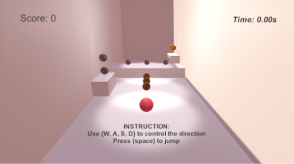
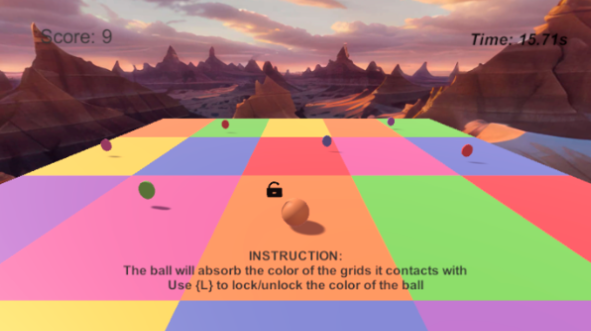
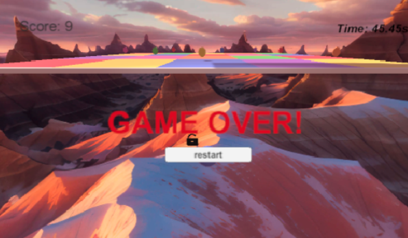
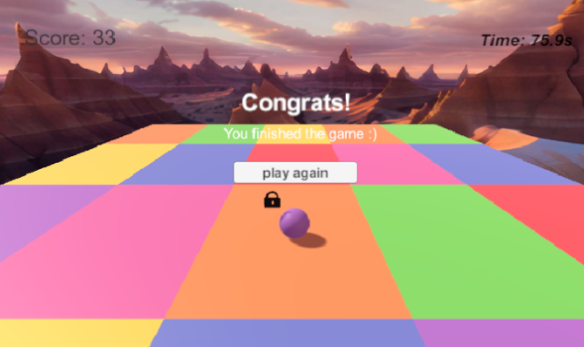
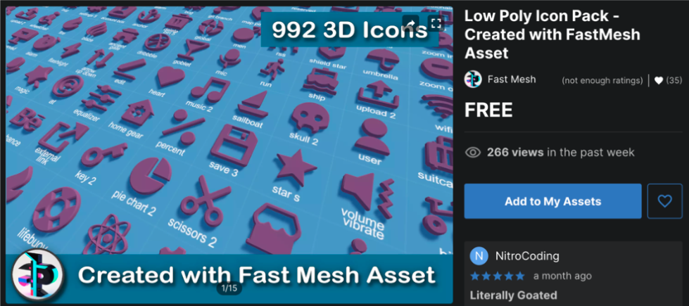
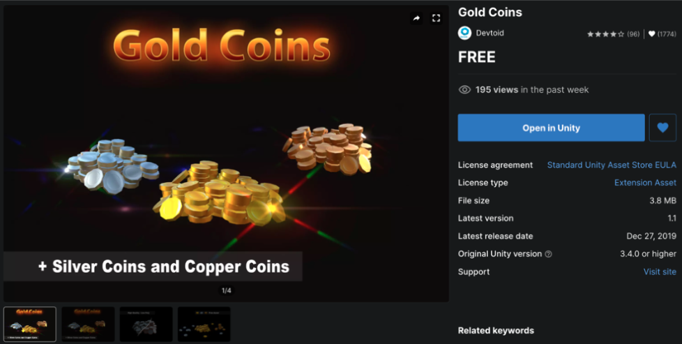
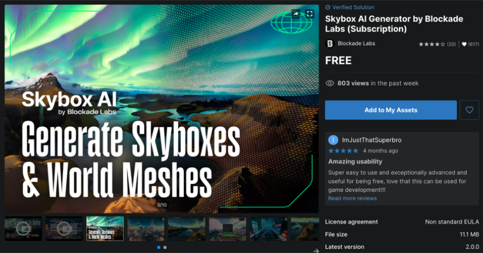
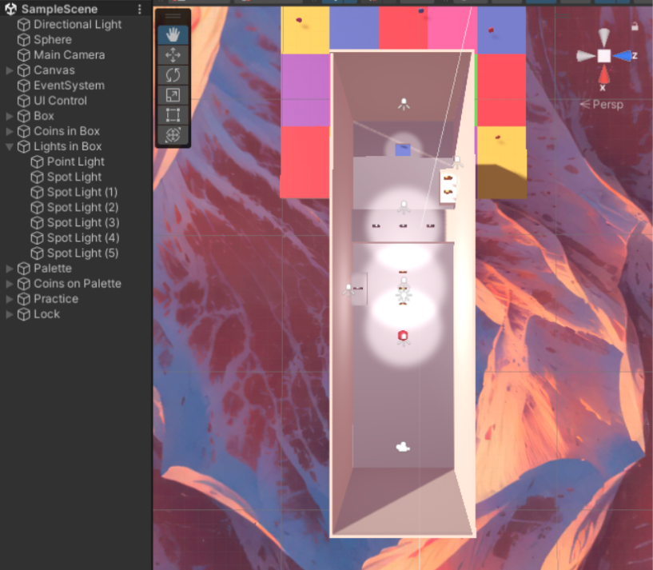
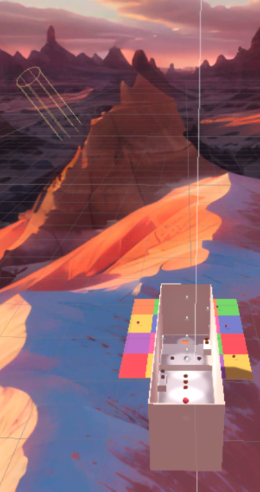

# Roll-A-Ball-Game

Unity Version: 2022.3.26f1

## Gameplay

This game consists of two main parts. The first part takes place in a room where players can
get familiar with the controls and practice jumping. The second part is on a colorful grid
surface where players must collect all the coins to clear the level. Players can control the
ball’s movement using **W** to move forward, **A** to move leftward, **S** to move backward, **D** to
move rightward, and the **spacebar (Space)** to jump. In the second part, players need to use
the L key to lock/unlock the ball’s color.

Below are screenshots from the two parts:

UI of the first part (left), UI of the second part (right).

  
  

## Game Over and Restart Mechanism
When the ball falls, the game ends, and a "Game Over" message will appear. Players can
press the restart button that appears to replay the game. If the player successfully collects all
the colored coins, they will clear the level, and a "Congrats" message will be displayed along
with a "play again" button, allowing the player to choose whether to play again.

  
  

## New Keyboard Events
When the player presses the spacebar (Space), the ball will jump to avoid obstacles or collect
coins for points. Pressing the L key will lock/unlock the ball's material (color).

## Effects of Three Game Mechanisms or Items
In the second part (colorful grid):

- Pressing the L key locks/unlocks the ball’s current color.
- The ball changes color based on contact with objects (floor, blocks).
- The ball can only collect coins of the same color; touching coins of other colors
has no effect (the ball will pass through them).

## External Materials Used
1. Low Poly Icon Pack - I used the icon-lock and icon-lock-unlock from this pack.

2. Gold Coins - I used the gold coins and silver coins from this pack.

3. Skybox AI Generator by Blockade Labs (Subscription)

## Lighting and Object Position
In the first part, which takes place indoors, I added six spotlights to guide the player forward,
hinting at where coins can be collected and leading the player into a square hole to reach the
second part. Additionally, I added a point light to increase overall brightness.

The lighting in the second part mainly comes from a directional light above, matching the
direction of the scene’s lighting.

  
  

